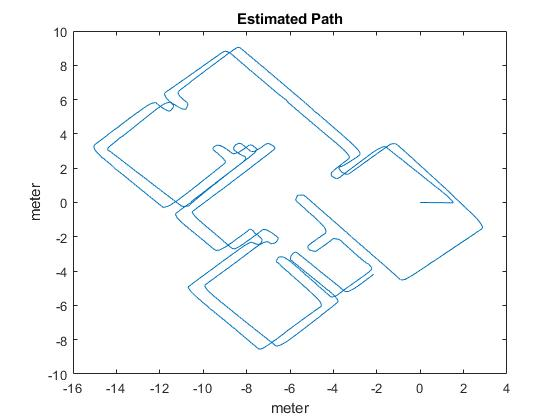
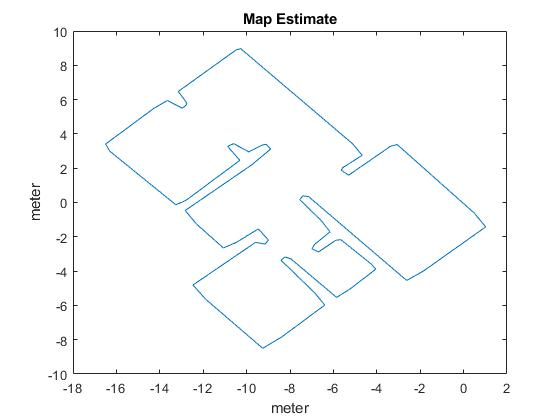
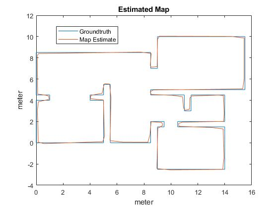

# Matlab Autonomous Lawn Mower
Matlab Simulation environment for the self-designed autonomous lawn mower of the University of Luebeck. This environment is used to test ideas in advance. There is also a simulation environment based on ROS and Gazebo available.

## Requirements
* Matlab2017b or higher with different packages, e.g. Robotic System Toolbox

## Get started
* Start by running the Initialization.m script which creates a startup.m script

* Run the startup.m script, this will add all folders of the package to your Matlab environment

* Start with by designing a script. Lets start by clear everything

```matlab
clear all
close all
clc
```

Let us assume we want to simulate a mapping procedure. Then we first have to load the groundtruth map with

```matlab
map = 'map_5.mat';
load(map);
```

The map will be appear as a struct called polyMap. It is quite easy to define closed maps as a polygon. In the folder maps you find a script where we generate such maps. Next, we initialize an instance of the ControlUnit class, which controls all required processes

```matlab
controlUnit = ControlUnit(polyMap,[0; 0; 0]);
```

We initialize the instance of the class with the given constructor. The constructor requires the true map of the environment and the starting pose [x,y,phi]. Now, we simulate the robot, for example let him drive along the boundary of the environment to generate path data which we can use for the map estimation

```matlab
[controlUnit,path,estPath] = controlUnit.wallFollowing(2000,0);
```

Here, the first parameter defines the simulation time in seconds (2000s) and the second the starting position (0 = random). We get now the simulation results for the true path and the estimated path. Let us print it

```matlab
figure,
plot(estPath(1,:),estPath(2,:))
title('Estimated Path')
xlabel('meter')
ylabel('meter')
```



Based on the estimated path, we can now generate a map estimate for the closed environment. We can define if we want to optimize the parameter for loop closure detection and pose graph optimization.

```matlab
optimize.loopClosure = true;
optimize.mapping = 0;
[controlUnit,mappingResults] = controlUnit.mapping(estPath,optimize);
```

Let us have a look onto our map estimate

```matlab
figure,
plot(mappingResults.closedDP(1,:),mappingResults.closedDP(2,:))
title('Map Estimate')
xlabel('meter')
ylabel('meter')
```



We can now compare our map estimate with the groundtruth by using

```matlab
comparisonResults = controlUnit.compare(6);
```

The results is an error of 3.65 percent. Let us have a look at the comparison

```matlab
figure,
plot(comparisonResults.PolyMap.x,comparisonResults.PolyMap.y)
hold on
plot(comparisonResults.EstPolyMap.x,comparisonResults.EstPolyMap.y)
title('Estimated Map')
xlabel('meter')
ylabel('meter')
legend('Groundtruth','Map Estimate')
```


## Functionality
Have a look onto our examples toi get a full overview over the functionality. The key concepts are
* Mapping
* Localization
* Complete Coverage Path Planning

## Issues:
* Resolve TODO's

